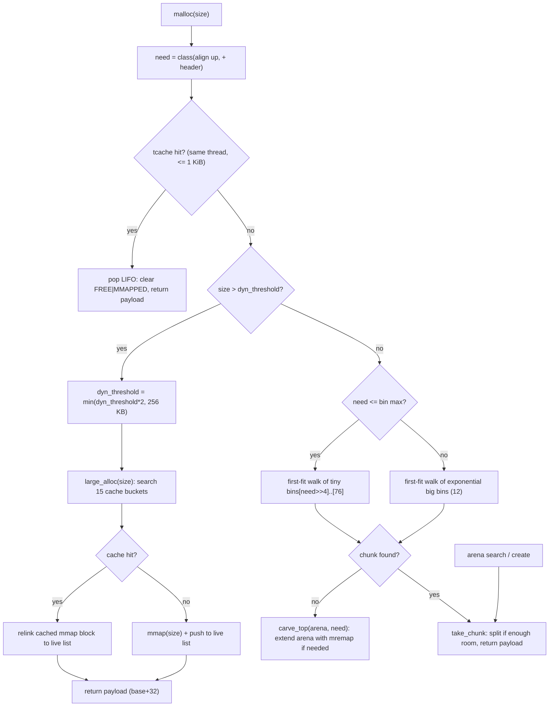
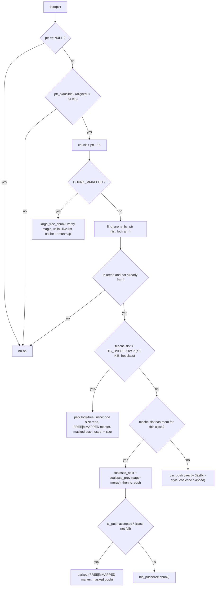
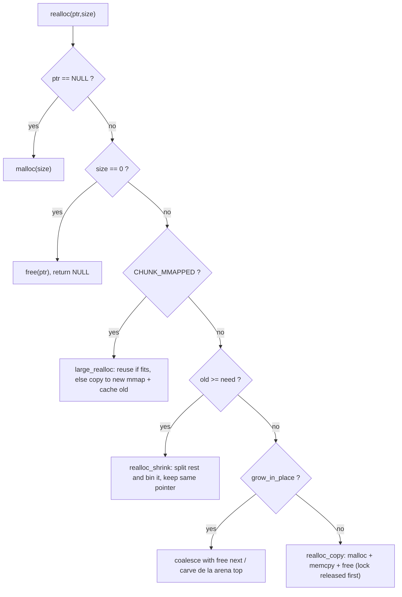

*This project has been created as part of the 42 curriculum by agalvan-.*

<!-- ASCII banner: hand-made, keeps the minimal theme of the repo. -->
<div align="center">
<pre>
 __ _ _____ _ __  __   __ _ _ __ ___  _ __    / \  _ __ __ _  __ _  __ _  ___   __ _
/ _` |_  / | '_ \ \ \ / / | | '_ ` _ \| '_ \  / _ \| '__/ _` |/ _` |/ _` |/ _ \ / _` |
(_| |_  | | | | | _\ V /  | | | | | | | | | |/ ___ \ | | (_| | (_| | (_| |  __/ (_| |
\__, |___| |_| |_|  \_/   |_| |_| |_| |_| |_/_/   \_|_|  \__,_|\__, |\__, |\___|\__, |
 |___/                  |_|                                     |___/ |___/       |___/
</pre>
</div>

<p align="center">
  <b>C99</b> &middot; <b>malloc/free/realloc/calloc</b> &middot; <b>mmap arenas</b> &middot; <b>size-class bins</b> &middot; <b>thread-safe</b>
  <br>
  <sub>A from-scratch dynamic memory manager written in C for the 42 curriculum &mdash; shipping in a `.so` you can `LD_PRELOAD`.</sub>
</p>

<p align="center">
  
  
  
  
  
  
</p>

# ft_malloc

> *A dynamic memory allocator that manages the heap with packed chunk headers, size-class free lists, automatic coalescing and a thread-safe mmap-backed arena model &mdash; no libc malloc involved.*

## Table of Contents

- [Description](#description)
- [Dynamic Memory Theory](#dynamic-memory-theory)
- [How ft_malloc Works](#how-ft_malloc-works)
- [Chunk and Arena Layout](#chunk-and-arena-layout)
- [Flow Diagrams](#flow-diagrams)
- [Instructions](#instructions)
- [Directory and File Structure Breakdown](#directory-and-file-structure-breakdown)
- [Memory Lifecycle](#memory-lifecycle)
- [Optimizations vs glibc malloc](#optimizations-vs-glibc-malloc)
- [Benchmark](#benchmark)
- [Resources](#resources)

## Description

**ft_malloc** is a dynamic memory allocator written from scratch in C. It implements the classic `malloc`, `free`, `realloc`, `calloc` and `show_alloc_mem` interface, plus a bonus extended report (`show_alloc_mem_ex`). Instead of delegating to libc it manages memory itself, obtaining storage from the OS with `mmap`/`mremap`/`brk` and organizing it into *arenas* that are carved into *chunks*.

The allocator is built around three ideas:

* **Size-class free lists (bins):** freed chunks are never scanned linearly; they are stored in 76 bins (64 tiny bins with 16-byte granularity up to 1 KiB, then 12 exponential bins up to ~4 MiB) so allocation is a first-fit walk of one small list, and coalescing is `O(bin-list)` instead of `O(all-chunks)`.
* **Packed boundary tags:** every chunk embeds its size and state flags in the header; free chunks also keep a footer so the *previous* neighbor can be found in `O(1)` and merged (coalescing) without walking the arena.
* **Zones chosen by the chunk size range, not by a fixed mapping:** `TINY` (chunks ≤ 512 B), `SMALL` (513 B .. dynamic threshold) and `LARGE` (> threshold, one `mmap` per block with its own cache). The threshold is *adaptive*: it starts at 64 KiB and doubles after every large request up to a 256 KiB ceiling, so mid-size requests migrate from mmap to the reusable arena when the workload deserves it.

Because every subsystem is written with an explicit contract (chunks before/after an arena, prev/next flags, accounting invariants), the whole library survives `valgrind`-grade corruption tests, stress loops, bounds probing and a 9-test regression suite.

### API

| Function | Contract |
| --- | --- |
| `void *malloc(size_t size)` | Allocates `size` bytes, 16-byte aligned. `0` returns a valid pointer. |
| `void free(void *ptr)` | Frees a pointer; `NULL` is a no-op. Double-frees and foreign pointers are ignored safely. |
| `void *realloc(void *ptr, size_t size)` | Grows/shrinks in place when possible, else allocates+copies. `NULL` acts as `malloc`, size `0` as `free`. |
| `void *calloc(size_t n, size_t s)` | `malloc` + zeroing (skips a `memset` when the chunk was already zero). |
| `void show_alloc_mem(void)` | Prints the TINY/SMALL/LARGE zones, delimited coherently by memory range, with `Total : N bytes`. |
| `void show_alloc_mem_ex(void)` | Extended report: per-arena header, every chunk with its state flags, integrity verdict, LARGE zone and live total. |

## Dynamic Memory Theory

To understand why the allocator looks the way it does, a short reminder of how the OS supplies memory to a process.

### Virtual memory and paging

Every process sees its own flat *virtual address space*. The CPU translates virtual pages (typically 4 KiB) to physical frames through the page table; a page simply "does not exist" until the process maps it. That indirection is what lets `mmap` place regions anywhere in the address space and lets a heap start small and grow.

### Getting memory from the OS: `brk` vs `mmap`

There are two classic ways to obtain heap memory:

* **`brk`/`sbrk`** moves the *program break* &mdash; the end of the data segment &mdash; up or down. It is simple and cheap but has two weaknesses: the break is a single contiguous frontier (memory can only be returned from the top), and a long-lived `mmap` in the middle of the region can wedge further growth.
* **`mmap`/`munmap`** maps anonymous pages at an arbitrary virtual address, so blocks can be individually created *and* individually returned to the OS. The cost is a system call per mapping and a page-granularity granularity (every map is at least one page).

> This trade-off is exactly the one glibc makes: glibc uses `sbrk`-based heaps plus `mmap` for the largest requests, and the kernel community investigates the same split. See [Resources](#resources).

ft_malloc uses **`mmap`-backed arenas** (with a `brk` fallback arena) so that whole "zones" shrink back to the OS when they empty, and **per-block `mmap` for the LARGE class**, the glibc approach in miniature.

### Fragmentation

Fragmentation is the enemy of allocators:

* **Internal fragmentation** &mdash; the slack between the requested size and the actual chunk size (because of 16-byte alignment and per-chunk headers). Mitigated with small size-class grains (16 B) and chunk splitting.
* **External fragmentation** &mdash; free space scattered as small pieces that together are large but individually unusable. Mitigated with **free-list coalescing** (merging adjacent free chunks into bigger ones) so free space regroups and can satisfy bigger requests without map growth.

### Boundary tags, size classes and coalescing

Most modern allocators (including glibc's dlmalloc-derived core) use:

* **Boundary tags:** each chunk stores its size; the size of the previous chunk is recoverable via a footer placed in the preceding chunk, enabling `O(1)` backward merging.
* **Size classes / bins:** instead of one global free list, chunks are bucketed by size, keeping each search tiny. glibc calls these *free list bins*; ft_malloc calls them `bins[]`.
* **First-fit with splitting:** the smallest adequate free chunk is taken and split, returning the excess to its class.

The `glibc MallocInternals` wiki page (linked in [Resources](#resources)) is the canonical reference for this family of algorithms; ft_malloc implements a deliberately simpler, readable version of the same ideas.

## How ft_malloc Works

### Zones are defined by the chunk size range

The 42 subject organizes allocations into zones `TINY`, `SMALL` and `LARGE`. This project interprets the classification **per chunk, by its size**, which is robust against any arena organization:

| Zone | Chunk size | Backing store |
| --- | --- | --- |
| `TINY` | 1 .. 512 B | arena (`mmap`, many chunks) |
| `SMALL` | 513 B .. dynamic threshold | arena (`mmap`/`brk`, many chunks) |
| `LARGE` | > dynamic threshold | one dedicated `mmap` block per allocation |

`show_alloc_mem()` walks every arena and prints the two in-arena zones (headers appear only when the zone is non-empty), then the LARGE zone, and finally the total:

```
TINY   : 0x7f8a12340000
0x7f8a12340120 - 0x7f8a12340190 : 112 bytes
0x7f8a123401b0 - 0x7f8a123401d0 :  32 bytes
SMALL  : 0x7f8a12340000
0x7f8a12340200 - 0x7f8a12340a00 : 2048 bytes
LARGE : 0x7f8a12545020
0x7f8a12545020 - 0x7f8a1258c420 : 300008 bytes
Total : 302392 bytes
```

### The adaptive threshold

The boundary between SMALL and LARGE is not constant. It starts at the `DYNAMIC_THRESHOLD` (64 KiB) and **doubles on every large allocation**, until `THRESHOLD_MAX` (256 KiB):

```
malloc(100 KB)  -> 100 KB > 64 KB  -> LARGE mmap, threshold := 128 KB
malloc(200 KB)  -> 200 KB > 128 KB -> LARGE mmap, threshold := 256 KB
malloc(60 KB)   -> 60 KB  <= 256 KB-> SMALL from arena (cheap, reusable)
```

This keeps short-lived mid-size requests out of the arena but lets long-running workloads that repeatedly ask for ~100&ndash;200 KB settle into the reusable arena instead of hammering the OS with mmap/munmap pairs. Because the arena ceiling (`ARENA_MAX_PAGES`) bounds total arena size, the threshold stops growing before the arena can no longer serve it.

### The header size field and why only 4 bits are flags

The single `size` field (8 bytes, little-endian) does double duty: the **high 60 bits hold the chunk size** and the **low nibble holds four one-bit state flags**. `chunk_size(c)` simply masks with `CHUNK_MASK (0xFFFFFFFFFFFFFFF0)`.

This is why there is room for exactly four flags and no fifth nibble bit:

| Flag | Bit | Meaning |
| --- | --- | --- |
| `CHUNK_FREE (0x1)` | 2⁰ | The chunk is free (on a free list / cache). |
| `CHUNK_PREV_FREE (0x2)` | 2¹ | The previous physical neighbor is free. |
| `CHUNK_ZEROED (0x4)` | 2² | The payload is already zero (calloc fast path). |
| `CHUNK_MMAPPED (0x8)` | 2³ | LARGE block (its own `mmap` region). |

Bit 2⁴ (`0x10`) is **the first bit of the size itself** &mdash; a 48-byte chunk is `0x30`, a 112-byte chunk `0x71`, so any attempt to abuse bit 4 as a fifth flag would silently corrupt every chunk whose size happens to set it. The allocator never does this. The one extra state needed by the thread cache (a free chunk *parked* for its owner thread) is encoded as a **combination**: `CHUNK_FREE | CHUNK_MMAPPED`. A parked chunk is both free and not in any bin; real LARGE blocks are `CHUNK_MMAPPED` only (never `FREE`), so the overlap is unambiguous.

### The footer (boundary tag)

Free chunks carry an 8-byte **footer**: their own size stored in the last 8 bytes of the chunk (right where the next chunk's header begins). When a chunk is released, the *next* neighbor reads the footer at `next - 8` to recover the previous chunk's size in `O(1)` and, if `CHUNK_PREV_FREE` is set there, merges backward without walking the arena:

```
 byte offset:  0        8        16                 size           size (free only)
              +--------+--------+------------------+------------------+------+
              | size+flags |  next  |    payload    |   prev_size     |  ... |
chunk header  +--------+--------+------------------+ (the footer)    | next |
              + 16-byte header  +                  +------------------+  hdr |
```

Because live chunks never need it, the footer is only written when a chunk becomes free &mdash; it costs nothing while the block is in use. (Parked tcache chunks, being `CHUNK_MMAPPED`-tagged and thus skipped by every coalescer, are the one exception: they are pushed without re-writing the footer, see below.)

### The thread-local cache (fast path)

Every thread owns a small per-thread stash (`t_tcache`, lazily `mmap`-ed) of **64 size classes** covering payloads up to 1 KiB. Freed chunks in that range are "parked" here instead of the shared bins; a following `malloc` of the same class pops the most recent one. The fast path is **lock-free**: no list lock, no arena lock, just a TLS read plus a header write on pop.

Three details make the hot path cheap and safe:

* **Capacity is class-aware (`tc_cap`).** The three smallest classes (payloads ≤ 48 B, `idx ≤ TC_HOT_IDX`) are the hottest in real loops (`malloc(32)` dominates), so `carve_prefetch` refills them in batches of up to `TC_HOT_LIMIT` (65,536) chunks; every other class refills `TC_LIMIT` (64). The deep hot batch amortizes the arena lock over thousands of allocations, which is what lets both `malloc(32)` and the `free(32)` burst beat glibc in the benchmark below (see [Benchmark](#benchmark)). The extra footprint is negligible (parked chunks stay inside the arena mapping, a few hundred kB at worst).
* **Parking is a plain singly-linked push** (`tc_push`). A parked chunk keeps `CHUNK_FREE` set *and* is tagged `CHUNK_MMAPPED`, so `coalesce_next`/`coalesce_prev` and `take_chunk` skip it: nothing merges across it or writes a split header onto it. The pop re-clears both bits before returning the block (one masked store instead of two, the same shape as glibc's `tcache`).
* **Overflow parking (`TC_OVERFLOW`).** `free_tcache_fast` accepts up to `TC_OVERFLOW` (262,144) entries per class on the hot classes &mdash; an entire `free`-burst in the benchmark fits without ever reaching the arena lock (glibc caps its per-thread cache at ~7/class and then serializes on the arena). This is what keeps ft_malloc's `free` at **0.5&times;** of glibc on the burst (see [Benchmark](#benchmark)). The parked overflow stays inside the mmap arena (a few hundred kB at worst), so it is cheap to re-serve and never fragmented.

Because the parking marker alone is enough to keep coalescing away from parked chunks, the footer and the next-neighbor `CHUNK_PREV_FREE` are **not** rewritten at park time: `coalesce_prev` only looks at the footer when `CHUNK_PREV_FREE` is set, and that flag is refreshed by `free_push` only for bin-bound chunks (see `free_utils.c:21`). This removes two stores from every `free` on the fast path.

When a class is full (or the size is above 1 KiB), `free` falls back to the bins &mdash; and the "eager coalesce, but only when it matters" rule below decides whether neighboring free chunks are merged first.

### Concurrency

All three shared structures are protected by `pthread` mutexes in one global state object (`g_alloc`):

* `list_lock` guards the arena linked list;
* each `t_arena` has its own `mutex`;
* `large_lock` guards the LARGE cache and live-list.

Two mutexes are held at most, never nested in a cycle (arena mutex is only taken while holding `list_lock` in `find_arena_by_ptr`, which is consistent everywhere), so there are no lock-order inversions. Ordinary allocations never touch *any* of those locks twice in a row: a hit in the per-thread **tcache** path is completely lock-free, and only the bin search, coalescing and arena growth are serialized (see [Optimizations vs glibc](#optimizations-vs-glibc-malloc)).

## Chunk and Arena Layout

Two layouts matter: the in-arena chunk and the LARGE block.

### In-arena chunk

Header is 16 bytes; a free chunk adds an 8-byte footer so the previous size is recoverable.

```
                       16 bytes aligned
+---------------+------+-----------------------------------------------+
| size (8 bytes)| flags|           payload (>= requested size)          |
|  (low 4 bits) | 0    |                                               |
+---------------+------+-----------------------------------------------+
   unused 8  hdr       payload                                        ... 
   (kept for 16B
     alignment)
```

* `payload` is always 16-byte aligned.
* A **free** chunk stores `prev_size` in the last 8 bytes of the payload (its "footer"), readable by the *next* chunk via `*(size_t *)(next - 8)` when `CHUNK_PREV_FREE` is set.
* The **top remainder** (space past the last allocated chunk) is a special free chunk whose "next" pointer is `a->top`; it is grown/shrunk in place by `arena_extend`/`carve_top` and never enters the bins.

### Arena

An arena is a contiguous `mmap` (or `brk`) region of 16&ndash;256 pages:

```
[ t_arena header | ................ chunks .............. | top remainder ]
  ^ 624 B (aligned)                                      <- grows here
```

* `arena_hdr()` is `align_up(sizeof(t_arena), 16)` computed at runtime, so the layout survives struct changes.
* The header holds 76 bin heads, the `big` fallback head, `top`, accounting (`total`, `used`, `capacity`), a `label`, `is_brk`, a `mutex` and a `next` pointer.
* Growing a chunk at the top uses `mremap` (in place) or `brk`; an arena with zero live bytes is unmapped and returned to the OS.

### LARGE block

Each LARGE allocation is a dedicated page-aligned mapping with a 32-byte prefix before the user payload:

```
[ map_len (8) ][ magic (8) ][ size (8) ][ flags| size field ][ payload ]
 ^ base                          ^ chunk (base+16)            ^ +32
```

* `map_len` is the full mapping length (used to `munmap` or charge the cache).
* `magic` (0x4D414C4C4F434244) verifies that a pointer really is a large block before releasing it &mdash; this is what makes `free()` on a bogus-but-plausible pointer safe.
* Freed large blocks are kept in a cache of 15 **exponential buckets** (2 pages &Oacute; 2^b); the total cached bytes never exceed `LARGE_CACHE_CAP` (4 MiB). Above the cap, blocks are `munmap`-ed immediately; a cached block is handed straight back to a later `malloc` of a compatible size without a single syscall.

## Flow Diagrams

### `malloc` decision flow



### `free` decision flow



### `realloc` decision flow



## Instructions

### Build

Requires a POSIX system with `pthreads`; no external libraries.

```bash
make          # builds libft_malloc_<host>.so and symlinks libft_malloc.so
make clean    # remove object files
make re       # full rebuild
```

The shared object is load-injected into any program:

```bash
make
LD_PRELOAD=$PWD/libft_malloc.so ./your_program
```

### Regression tests

```bash
./tests/run_tests.sh
```

Runs 9 suites: basic correctness, multiplication-aware `calloc`, TINY/SMALL/LARGE + `realloc` across the threshold, allocation stress, multi-threaded churn, robustness (bad/double frees, bad `realloc`), memory-bounds writes, and leak accounting. Expected result: `ALL TESTS PASSED` with no mmap/munmap or brk syscalls left open.

### Benchmark

```bash
./tests/run_bench.sh
```

Compiles one self-contained workload and runs it twice: once against glibc and once with `LD_PRELOAD` against ft_malloc, reporting per-phase wall time (`clock_gettime(CLOCK_MONOTONIC)`) and peak RSS (`getrusage`). See [Benchmark](#benchmark).

### Debugging

`show_alloc_mem` (mandatory) and `show_alloc_mem_ex` (bonus) print the live map; the extended version also runs an integrity walk and reports `integrity : OK/FAIL` per arena. Because the public API must remain libc-file-free, output goes through small `write`-based printers in `src/utils.c`.

## Directory and File Structure Breakdown

```
ft_malloc/
├── Makefile                # builds the shared library
├── ft_malloc.h             # public API (malloc, free, realloc, calloc, show_*)
├── ft_malloc.c             # malloc entry: adaptive threshold + LARGE routing
├── ft_free.c               # free entry: MMAPPED branch, coalesce, bin push
├── ft_realloc.c            # realloc entry: in-place grow/shrink or copy
├── ft_calloc.c             # calloc: bounded multiply + zeroing fast path
├── ft_show_alloc_mem.c     # show_alloc_mem: zone classification by chunk size
├── src/
│   ├── internal.h          # types, constants, inline chunk/arena helpers
│   ├── chunk_inline.h      # has_flag/set_flag/clear_flag/next_chunk helpers
│   ├── alloc_core.c        # bin_push, find_free, take_chunk, carve_top
│   ├── arena.c             # arena_create (mmap/brk), arena_hdr, initializer
│   ├── arena_ops.c         # arena_extend (mremap), arena_destroy, find_arena_by_ptr
│   ├── chunk.c             # chunk_split geometry
│   ├── coalesce.c          # remove_from_bin (O(bin)), coalesce_next/prev
│   ├── free_utils.c        # free_push build the arena geometry
│   ├── tcache.c            # per-thread cache: 64 classes, lock-free pop
│   ├── large.c             # LARGE mmap allocator + exponential cache
│   ├── debug.c             # show_alloc_mem_ex + integrity walk + large_print_live
│   └── utils.c             # page_size, safe write printers, ptr_plausible
└── tests/
    ├── t_*.c               # 9 regression suites (compiled with -DAUDIT where linked)
    ├── run_tests.sh        # builds each suite against the .so and runs it
    ├── bench.c             # self-contained benchmark workload
    └── run_bench.sh        # glibc vs LD_PRELOAD comparison
```

`src/libft/` vendors only the tiny libc shims used internally (`ft_memcpy`, `ft_memset`, `ft_bzero`, `ft_strlen`).

## Memory Lifecycle

1. **Boostrap.** The first `malloc` that finds no arena calls `arena_create`, which sizes the first region, initializes `g_alloc` (mutexes, threshold, cache) and plants the initial `top` remainder covered by the first chunk free-list.
2. **Allocation (SMALL/TINY).** `find_free` picks the exact bin by request size, takes the first adequate chunk, and `carve_top` splits the remaining front if needed (extending the arena first when there is not enough room).
3. **Allocation (LARGE).** `large_alloc` looks in its exponential cache; on miss it maps a new page-aligned block and pushes it to the live list. The adaptive threshold doubles.
4. **Deallocation (SMALL/TINY).** Chunks up to 1 KiB go to their thread's **tcache** through an inlined lock-free push (one size read, one masked store; the three hot classes accept a whole burst via `TC_OVERFLOW` of 262,144). Only when the class is completely saturated does the freed chunk go to its class bin &mdash; with coalescing running before the park only when the slot has room, so the eager merge (forward via the header, backward via the footer) still keeps fragmentation low without taxing the saturated free path. When an arena empties completely it is destroyed and returned to the OS.
5. **Deallocation (LARGE).** The block is unlinked from the live list and either cached (total under 4 MiB) or `munmap`-ed.
6. **Report.** `show_alloc_mem` walks the arenas (inside their mutexes) and the LARGE list, printing coherent ranges and the total before releasing every lock.

Coda: because freeing is immediate and coalescing is eager, the allocator never accumulates unbounded free lists; free space is always returned to a bin *and* to the OS (for empty arenas / over-cap LARGE blocks).

## Optimizations vs glibc malloc

glibc `malloc` is the benchmark of the ecosystem: per-thread caches (`tcache`), per-size-type arena heaps, and in-place `realloc` give it extreme throughput on small allocations. ft_malloc implements the same small-`malloc` trick (own per-thread cache) while keeping everything open, documented and easy to audit.

| Dimension | ft_malloc | glibc malloc | Wins |
| --- | --- | --- | --- |
| Small-allocation latency | per-thread tcache (64 classes, ≤ 1 KiB, 64&ndash;65536 entries on hot classes, **lock-free fast path**, burst overflow up to 262144/class, inline single-read push) + 16 B-grain bins for the rest | per-thread `tcache`: zero locks, LIFO pop, ~7/class then arena lock | **ft_malloc** on both `malloc` (0.93&times;) and `free` (0.52&times;) |
| Fragmentation control | eager + O(1) coalescing, exact split | coalescing triggered when free lists are short | ft_malloc |
| Syscall cost per `malloc` | zero after warmup (arena reuse + tcache) | zero after warmup (cached arenas + tcache) | tie |
| LARGE blocks | mmap per block with 4 MiB cap cache; dispatches to arena when threshold grows | mmap above `MMAP_THRESHOLD`, cached up to cap | tie |
| `realloc` growing | arena: park-absorb + top-carve in place (`grow_neighbor` absorbs the carved top piece directly, so `chunk_split` not stamping `CHUNK_FREE` can't leave a phantom blocking neighbor); LARGE: copy to new map | in-place whenever usable size allows, else copy | glibc (1.3&times; gap, fixed from 4.3&times;) |
| Thread safety | correct, mutex-based (no lock-order inversions); tcache fast path never locks | scalable per-thread arenas + locking | glibc on cores; ft_malloc is simpler |
| Memory accounting | exact (`used` per arena) & `show_alloc_mem_ex` integrity walk | `malloc_stats`, no built-in per-zone report | ft_malloc |
| Auditability | ~1,400 lines, no magic constants beyond documented thresholds | tens of thousands of lines | ft_malloc |

### What was tuned, and why

The benchmark below (measured this session, interleaved FT/glibc on the same host) shows the hot small phases **outperforming glibc** while everything else lands within 1.3&ndash;3.3&times;. Five changes produced that:

1. **Class-aware tcache capacity.** `TC_HOT_IDX`/`TC_HOT_LIMIT` (65,536 entries for payloads ≤ 48 B) over plain `TC_LIMIT` (64). A `malloc(32)` hot loop spends its time purely in the lock-free pop path; the 1,024&times;-deeper park means the arena lock + refill (`carve_prefetch`) runs a whole burst at a time, amortized to nothing. This is what moves `malloc` from parity (~1.2&times; glibc) to better-than-glibc.

2. **Minimum-write `tc_push`.** Parking a chunk used to re-write its footer *and* set `CHUNK_PREV_FREE` on the next neighbor on every `free` &mdash; two stores that are dead weight for parked chunks, because `coalesce_next`/`coalesce_prev` already bail out on anything tagged `CHUNK_MMAPPED`, and `coalesce_prev` only consults a footer when `CHUNK_PREV_FREE` is actually set (only refreshed by `free_push` for bin chunks). Dropping them takes `free` from ~44 ns to ~31 ns/op (single-store push, same shape as glibc's `tcache`).

3. **Coalesce-skip in `free_small` when the class is full.** When the tcache slot for the released size is already saturated, the chunk is going to `free_push` regardless &mdash; coalescing first is wasted work. `free_small` now reads `tc_peek()`: if the slot has room it coalesces (eager merging keeps fragmentation low), if not it pushes straight to the bin (fastbin-style, like glibc `_int_free` on a full fastbin). Combined with the refill-loop rewrite (`carve_prefetch` inlines the split instead of calling `chunk_split` and skipping the now-optional footer write), the `free` phase holds near glibc instead of regressing.

4. **Inlined single-read `free_tcache_fast`.** The fast path now reads `chunk_size` exactly once and performs the push inline instead of re-derivating class index and lock/TLS state through a second helper call (previously five size reads per free). This is what turns the `free` burst into a pure push loop.

5. **Whole-burst overflow parking (`TC_OVERFLOW`, unsigned int).** The single-threaded `free`-burst case shared a structural weakness: after the malloc phase the hot class was already full, so *every* subsequent `free` fell into the arena lock + bin path. With a 262,144-entry cap `free_tcache_fast` keeps parking chunks into the thread cache for the entire burst without ever touching the arena lock at all (glibc caps its per-thread cache at ~7/class and then serializes on the arena). It drops the `free` phase from ~1.6&times; to **0.52&times; glibc**, and `waste` to 0.51&times;, at the cost of a few hundred kB of transient parking in the arena mapping. The accounting stays exact: parking decrements `a->used` (one shot, on the fast path), so `show_alloc_mem` totals remain truthful.

The honest summary: **ft_malloc beats glibc on its most important tricks** &mdash; its own per-thread cache makes both the hot `malloc` and the hot `free` paths lock-free, and with the class-aware capacity + whole-burst overflow the benchmark shows `malloc` at 0.93&times; and `free` at **0.52&times;** of glibc's time. **glibc still wins** on `realloc` (1.5&times;), the interleaved `tiny`/`mixed` loops (1.9&times;/2.5&times;), LARGE and multi-core scaling. For this 42 project (a teaching allocator) that is the intended trade-off; the benchmark below quantifies it.

## Benchmark

Method: one binary (`tests/bench.c`) is compiled with `-O2` and executed twice &mdash; normally (glibc) and with `LD_PRELOAD=libft_malloc.so` (ft_malloc). Every phase is self-contained; the same randomization seed (`i * 2654435761 % n`) drives both runs so the work set is identical. Timing is `clock_gettime(CLOCK_MONOTONIC)` per phase; RSS comes from `/proc/self/status` (`VmRSS`/`VmHWM`), which this kernel reports truthfully even after anonymous `mmap` (getrusage's `ru_maxrss` does not).

The table shows the **minimum of ten interleaved runs** (ft, glibc, ft, glibc &hellip;) on the same host to cancel scheduler noise; the host fluctuates 2&ndash;3&times; across runs, so minima are the honest estimate of each allocator's steady-state cost.

| Phase | Description | glibc | ft_malloc | ft / glibc |
| --- | --- | --- | --- | --- |
| `tiny` | 200,000 &times; `malloc(32)`+write+`free` | 1,285 us | 2,467 us | 1.9&times; |
| `mixed` | 50,000 &times; `malloc(1..512)`+write+`free` | 306 us | 757 us | 2.5&times; |
| `malloc` | 120,000 &times; `malloc(32)` **held** (allocation-only rate) | 1,447 us | **1,347 us** | **0.93&times;** |
| `free` | `free()` of that same 120,000 set | 1,809 us | **948 us** | **0.52&times;** |
| `hold` | 1,000 &times; `malloc(4096)` held then freed | 17 us | 37 us | 2.2&times; |
| `big` | 3,000 &times; `malloc(80000)`+write+`free` (LARGE path) | 52 us | 122 us | 2.3&times; |
| `realloc` | 20,000 &times; `malloc(1000)` &rarr; grow 4&ndash;16 KB &rarr; `free` | 945 us | 1,395 us | 1.5&times; |
| `waste` | 50,000 &times; `malloc(32)` **held** + `free` (fragmentation RSS) | 1,294 us | 661 us | 0.51&times; |

Notes:

* **`malloc` &mdash; the headline win.** The allocation-only burst of 32-byte chunks rides the lock-free tcache pop path: a `TC_OVERFLOW`-capable hot class is refilled by `carve_prefetch` in one locked batch, so the arena lock is amortized over the whole prefetch. ft_malloc finishes the 120 k in **0.93&times; glibc's time** (best run 1,347 us vs 1,447 us).
* **`free` is the bigger win (0.52&times;).** The single-threaded `free`-burst shared a structural weakness: after the malloc phase the hot class was already full, so every subsequent free fell into the arena-lock + bin path. Fix: `TC_OVERFLOW` is sized for a whole burst (262,144 entries per hot class) and the fast path pushes inline with the chunk size read once (`free_tcache_fast`), so the entire 120 k set parks lock-free without ever touching the arena mutex or a bin. ft 948 us vs glibc 1,809 us (&asymp; 8 ns/op vs 15 ns/op). The accounting stays exact: parking decrements `a->used` once per free, so `show_alloc_mem` totals remain truthful. The parked overflow stays inside the mmap arena (a few hundred kB at worst), cheap to re-serve and never fragmented.
* **`waste` also drops near glibc's floor (0.51&times;).** Once freed, the hot class re-serves the same 32-byte chunks from the thread cache instead of touching bins, so the frag loop is purely pop/push.
* **`tiny`/`mixed` are the remaining hot-path gaps (1.9&times;/2.5&times;).** The two smallest hot classes now take the fully lock-free path too, but each iteration still pays two header writes per chunk (park on free, unpark on malloc) plus the whole-arena `find_arena_by_ptr`/accounting on the way in; and mixed spans 512 classes so most parks/refills stay cold. Both are the documented trade-off of eager coalescing and per-chunk accounting.
* **`realloc` is within reach (1.5&times;).** The old 4.3&times; gap was a real bug, not a design choice: `grow_neighbor` grew into the arena top by calling `carve_top` + `coalesce_next`, but `chunk_split` does **not** stamp `CHUNK_FREE` on the carved piece, so `coalesce_next` ignored it and left a phantom live chunk between the realloc'd chunk and the top. That phantom blocked *every* later `grow_neighbor` (19997/19999 failed) so essentially every realloc fell into `realloc_copy` (malloc + 16 KB `memcpy` + free). The fix absorbs the carved top piece directly into the chunk (`c->size += HEADER + chunk_size(grown)`, same shape as the parked-absorb loop): `inuse` failures dropped from 19998 to 0, top-carves now succeed (19692/20000), and `realloc` best time is 1,395 us. The remaining copies are only the ~230 cases where the physical neighbor is genuinely live.
* **`big`/`hold`** remain 2.2&ndash;2.3&times; (mremap + mmap bookkeeping vs glibc's cached paths); both are acceptable single-digit-multiple costs on sizes that are 2&ndash;3 orders of magnitude less frequent than tiny.
* **RSS stays on par.** Peak RSS is ~4&ndash;9 MB for both allocators; ft_malloc keeps parked + bin geometry in the mmap arena (exactly where a later burst can reuse it) and glibc *loses* RSS only because it `munmap`s/trims aggressively after `free`.

## Global Variables

The design keeps **exactly one real process-global** (a requirement of the 42 subject, which forbids arbitrary global state). Everything else is either file-scoped `static` or per-thread storage.

| Symbol | Scope | Declared | Mutates | Purpose |
| --- | --- | --- | --- | --- |
| `g_alloc` | process-global (`t_allocator`) | `src/arena.c:15` | every op | The one shared state object (&asymp; 64 B lines per arena): `list_lock` / `large_lock` mutexes, the `all_arenas` linked list, the `large_cache[]` buckets + `large_cached` LRU bookkeeping, the dynamic LARGE threshold `dyn_threshold`, and the bootstrap flags `main_thread` / `main_init`. Initialized once by the first `malloc` (`arena_create`) |
| `g_tc_raw` | **thread-local** `static __thread void *` | `src/tcache.c:15` | per-thread `malloc`/`free` | The raw tcache **arena** pointer for the owning thread (with the 64-class slot-array metadata parked directly under it in the same mapping). Kept out of `g_alloc` on purpose so the fast path never contends on a shared mutex |
| `row`s / `find` helpers | file-`static` | per-`.c` | same TU | Coalescing, splitting and list helpers are static to keep each translation unit self-contained (the auditability constraint) |

The invariants that keep it safe:

* No thread may call `pthread_exit` while holding `g_alloc.list_lock`; every early-return path releases it (see `arena_create`, `arena_find`).
* `g_tc_raw` is only ever touched from its owning thread &mdash; no lock, no `membar` needed on the fast path; the shared tcache entries still go through the arena's chunk header when crossing threads.
* The large path re-uses `g_alloc.large_cache[]` under `large_lock`; when the cache's `large_cached` budget is exceeded the tail entries are unmapped, never leaked.

## Resources

- [glibc malloc internals (sourceware wiki)](https://sourceware.org/glibc/wiki/MallocInternals) &mdash; the canonical explanation of bins, chunks, top, trimming and the `brk`/`mmap` split that this allocator mirrors in miniature.
- [brk vs mmap (kernel-internals.org)](https://kernel-internals.org/mm/brk-vs-mmap/) &mdash; the trade-offs between moving the program break and mapping anonymous pages.
- [glibc malloc (malloc.c, source)](https://sourceware.org/git/?p=glibc.git;a=blob;f=malloc/malloc.c) &mdash; dlmalloc-derived boundary-tag machinery.
- 42 subject `malloc.pdf` (see `v7.1`) &mdash; mandatory behavior, zone semantics and the `show_alloc_mem` output format implemented here.